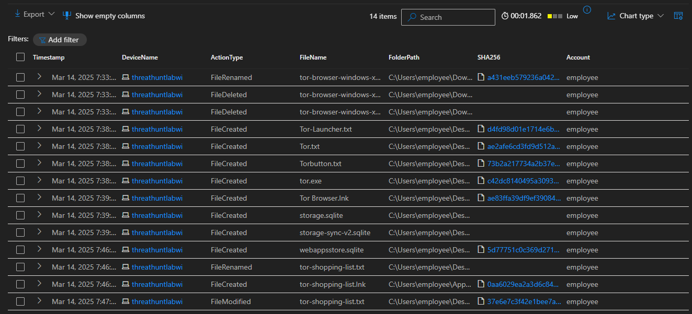
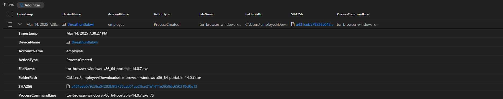
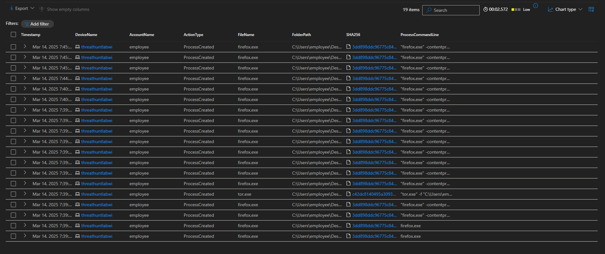
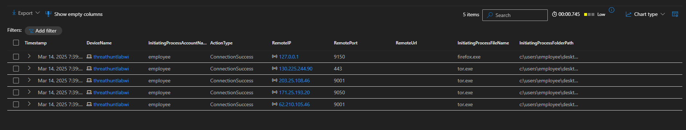

# Threat Hunt Report: Unauthorized TOR Usage
- [Scenario Creation](https://github.com/joshmadakor0/threat-hunting-scenario-tor/blob/main/threat-hunting-scenario-tor-event-creation.md)

## Platforms and Languages Leveraged
- Operating System: Windows 10 Virtual Machines (Microsoft Azure)
- Security Monitoring Tool: Microsoft Defender for Endpoint (EDR)
- Query Language: Kusto Query Language (KQL)
- Target Software: Tor Browser (Unauthorized)

## Scenario
Management suspects unauthorized usage of the TOR Browser by employees, based on suspicious encrypted network traffic logs and anonymous internal reports indicating employees discussing methods to bypass network controls to access restricted sites. The security team's objective is to identify, confirm, and analyze incidents involving TOR Browser usage, evaluate associated security risks, and inform management promptly.

## High-Level TOR-Related IoC Discovery Plan
To detect TOR usage, the investigation focused on:

- **File Activity**: Searching for file-related events involving "tor.exe," "firefox.exe," or TOR-related file installations.
- **Process Activity**: Checking for the installation and execution of suspicious processes related to the TOR Browser.
- **Network Connections**: Identifying network connections to known TOR-related ports or known TOR nodes.

---

## Steps Taken

### 1. File Activity Analysis (DeviceFileEvents)
Initial investigation in the file events table indicated the user account "employee" downloaded the TOR installer and performed several file activities involving TOR-related files on the endpoint `threathuntlabwi`.

***KQL Query Executed:***

```kql
DeviceFileEvents
| where DeviceName == "threathuntlabwi"
| where InitiatingProcessAccountName  == "employee"
| where FileName contains "tor"
| where Timestamp >= datetime(2025-03-14T23:33:05.7260973Z)
| order by Timestamp asc
| project Timestamp, DeviceName, ActionType, FileName, FolderPath, SHA256, Account = InitiatingProcessAccountName
```


---

### 2. TOR Installation Detection (DeviceProcessEvents)
The process event logs confirmed the silent installation of the TOR browser from the downloaded executable file.

***KQL Query Executed:***

```kql
DeviceProcessEvents
| where DeviceName == "threathuntlabwi"
| where ProcessCommandLine contains "tor-browser-windows-x86_64-portable-14.0.7.exe"
| project Timestamp, DeviceName, AccountName, ActionType, FileName, FolderPath, SHA256, ProcessCommandLine
```


---

### 3. TOR Browser Execution Detection (DeviceProcessEvents)
Further process analysis confirmed the successful execution of TOR Browser-related executables, including firefox.exe and tor.exe.

***KQL Query Executed:***

```kql
DeviceProcessEvents
| where DeviceName == "threathuntlabwi"
| where FileName has_any ("tor.exe", "firefox.exe", "tor-browser.exe")
| project Timestamp, DeviceName, AccountName, ActionType, FileName, FolderPath, SHA256, ProcessCommandLine
| order by Timestamp desc
```


---

### 4. TOR Network Connections Detection (DeviceNetworkEvents)
Network events analysis confirmed multiple connections to known TOR network ports and IP addresses, validating active TOR browser usage.

***KQL Query Executed:***

```kql
DeviceNetworkEvents
| where DeviceName == "threathuntlabwi"
| where InitiatingProcessAccountName != "system"
| where InitiatingProcessFileName in ("tor.exe", "firefox.exe")
| where RemotePort in ("9001", "9030", "9040", "9050", "9051", "9150", "80", "443")
| project Timestamp, DeviceName, InitiatingProcessAccountName, ActionType, RemoteIP, RemotePort, RemoteUrl, InitiatingProcessFileName, InitiatingProcessFolderPath
| order by Timestamp desc
```


---

## Chronological Incident Timeline

### 1. File Download - TOR Installer

- **Date & Time:** `2025-03-14T23:33:05.7260973Z`
- **Action:** File download event detected
- **Details:** User "employee" downloaded the installer file `tor-browser-windows-x86_64-portable-14.0.7.exe` to the Downloads folder.
- **File Path:** `C:\Users\employee\Downloads\tor-browser-windows-x86_64-portable-14.0.7.exe`

### 2. Silent Installation - TOR Browser

- **Date & Time:** `2025-03-14T23:38:27.2303028Z`
- **Action:** Process execution event detected (Silent installation initiated)
- **Details:** User executed the downloaded installer silently (/S flag), installing TOR Browser without user prompts.
- **Command:** `tor-browser-windows-x86_64-portable-14.0.7.exe /S`

### 3. TOR Browser Launch

- **Date & Time:** `2025-03-14T23:39:26.085155Z`
- **Action:** TOR Browser executable launch detected
- **Details:** User actively opened the TOR browser. Subsequent associated processes (firefox.exe and tor.exe) spawned successfully.
- **Executable Path:** `C:\Users\employee\Desktop\Tor Browser\Browser\TorBrowser\Tor\tor.exe`

### 4. Initial TOR Network Connection

- **Date & Time:** `2025-03-14T23:39:42.2783796Z`
- **Action:** Successful network connection detected
- **Details:** TOR Browser connected to external TOR node at IP `62.210.105.46` on port `9001`, confirming active usage.
- **Initiating Process:** `tor.exe`

### 5. Additional TOR Network Connections

- **Date & Time:**
`2025-03-14T23:39:45.8561439Z` (Connection to `130.225.244.90` port `443`)
`2025-03-14T23:39:51.476831Z` (Localhost connection to `127.0.0.1` port `9150`)
- **Action:** Ongoing successful TOR-related network connections
- **Details:** Multiple connections, indicative of continuous TOR Browser usage.

### 6. Creation of TOR-related File

- **Date & Time:** `2025-03-14T23:46:28.0999635Z`
- **Action:** File creation detected on Desktop
- **Details:** User created `tor-shopping-list.txt`—potential notes or records related to TOR browser activity.
- **File Path:** `C:\Users\employee\Desktop\tor-shopping-list.txt`

---

## Summary
The detailed investigation conclusively identifies that the employee user intentionally downloaded, installed (silently), and actively used the TOR Browser application on the corporate endpoint "`threathuntlabwi`". Multiple network connections to known TOR nodes and the creation of TOR-related files further substantiate active use. This activity potentially poses security risks by circumventing established corporate security controls and policies.

---

## Response Taken
Upon confirmation of unauthorized TOR usage by user "employee", the following immediate response actions were executed:

Endpoint Isolation: Immediate isolation of endpoint "`threathuntlabwi`" to prevent further unauthorized activity.
Management Notification: Employee's direct manager was promptly informed of the incident details for further action.

---
